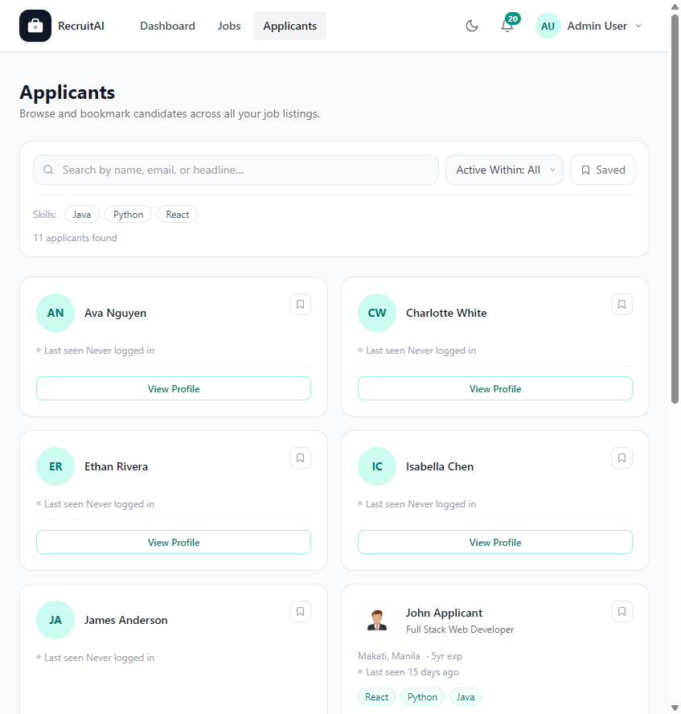

# All Applicants

## Overview

The Applicants page gives Recruiters, HR staff, and Administrators a single place to browse every Applicant who has applied across all of your job postings. The page is shown below.

## Purpose

Instead of checking each Job Posting one at a time, this page lets you search and filter your entire Applicant pool. It is useful when you want to find a specific Applicant, discover people with a particular skill, or bookmark promising Applicants for future openings.

## Available Features

- Search Applicants by name, email, or headline
- Filter Applicants by how recently they were active (for example, within the last day, week, or month)
- Filter by skill using the skill tag buttons
- View how many Applicants match your current search and filters
- Bookmark an Applicant directly from their card
- Open an Applicant's full profile with "View Profile"
- Open an Applicant's Resume, when one has been uploaded

## Step-by-Step Guide

1. Open the Applicants page from the main navigation bar.
2. Type a name, email, or headline into the search box to narrow the list, then select "Search".
3. Use the "Active Within" filter to focus on Applicants who have used the platform recently.
4. Select a skill tag to show only Applicants who list that skill.
5. Select "Bookmark" on an Applicant's card to save them for later, or "View Profile" to see their full details.

## Notes

- This page is available to Recruiters, HR staff, and Administrators. Applicants do not see this page.
- If no Applicants match your search or filters, the page will tell you so you can adjust your criteria.

## Tips

- Bookmark strong Applicants as soon as you find them, even if you are not ready to move them into a Pipeline yet. You can find them again from Saved Applicants.
- Combine the skill filter with a search term to narrow large Applicant pools quickly.
