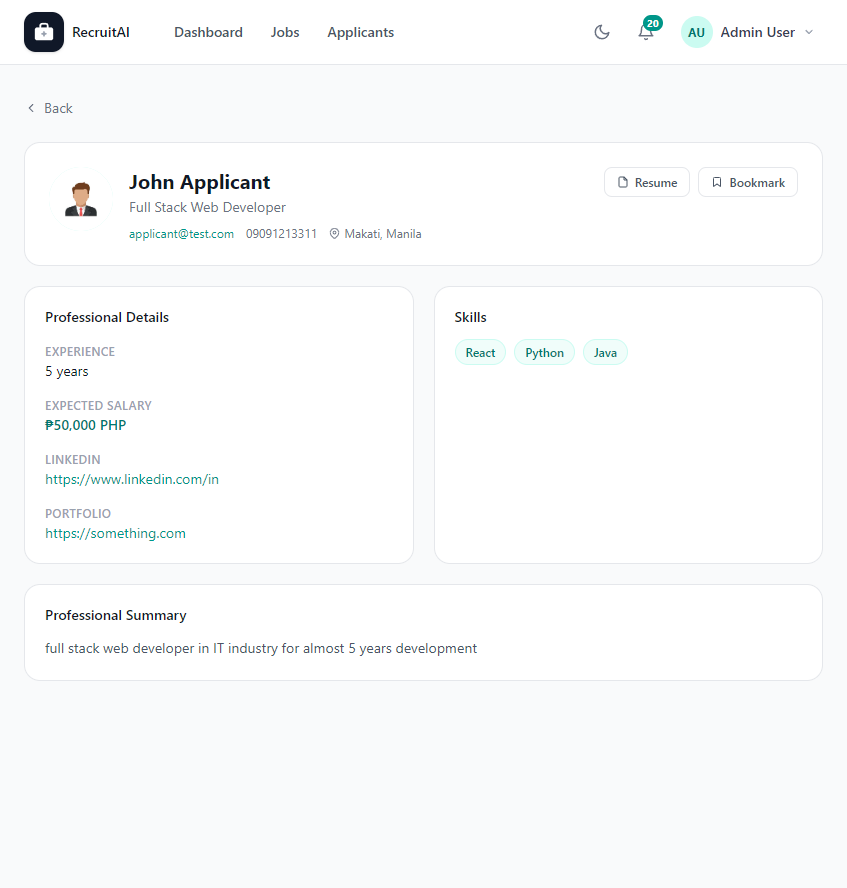

# Applicant Profile

## Overview

The Applicant Profile page shows the full details of a single Applicant, including their contact information, experience, skills, and Resume. The page is shown below.

## Purpose

This page helps Recruiters, HR staff, and Administrators evaluate an Applicant in depth before deciding whether to move them forward for a Job Posting.

## Available Features

- Applicant's name, headline, email, phone number, and location
- Link to download or view the Applicant's Resume
- Years of experience and expected salary
- Links to the Applicant's LinkedIn and portfolio, when provided
- List of the Applicant's skills
- Professional summary written by the Applicant
- A "Bookmark" button to save the Applicant for later

## Step-by-Step Guide

1. From the Applicants page or a Job's Applicants list, select an Applicant's name or "View Profile".
2. Review their contact details, experience, and skills.
3. Select "Resume" to open their uploaded Resume in a new tab.
4. Select "Bookmark" if you want to save this Applicant to your Saved Applicants list.
5. Select "Back" to return to the previous page.

## Notes

- This page is available to Recruiters, HR staff, and Administrators. Applicants cannot view other Applicants' profiles.
- Some fields, such as LinkedIn or portfolio links, only appear if the Applicant provided them.

## Tips

- Check the Resume link before contacting an Applicant, since it often contains details not shown on the profile itself.
- Use the Bookmark button here instead of navigating back to the Applicants list, to save time.
