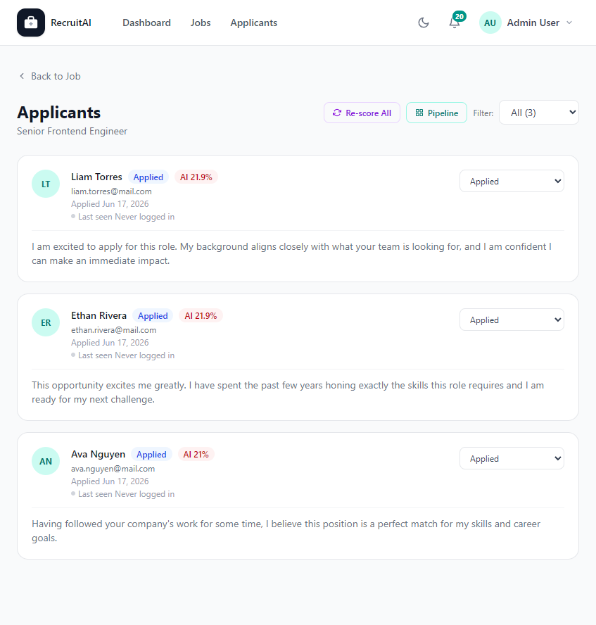

# Job Applicants

## Overview

The Job Applicants page lists everyone who has applied to one specific Job Posting. The page is shown below.

## Purpose

This page helps Recruiters, HR staff, and Administrators review and manage everyone interested in a particular Job Posting, without having to look through the entire Applicant pool.

## Available Features

- List of Applicants who applied to this Job Posting, with their email and application date
- AI match score showing how closely each Applicant's profile matches the Job Posting
- Each Applicant's cover message
- A status dropdown for each Applicant (Applied, Under Review, Shortlisted, Interview Scheduled, Rejected, Hired)
- A filter to show Applicants by status
- "Re-score All" to refresh the AI match scores for every Applicant
- A link to the Pipeline view for this Job Posting

## Step-by-Step Guide

1. Open a Job Posting and select "View Applicants", or select an Applicant count from the Dashboard.
2. Review each Applicant's match score and cover message.
3. Use the status dropdown next to an Applicant to move them to the next stage, such as "Shortlisted" or "Interview Scheduled".
4. Use the "Filter" dropdown to show only Applicants at a particular stage.
5. Select "Re-score All" if you have updated the Job Posting and want fresh match scores.
6. Select "Pipeline" to see all Applicants for this Job Posting organized by stage on a board.

## Notes

- This page is available to Recruiters, HR staff, and Administrators.
- The AI match score is a guide to help you prioritize review. It does not replace reading the Applicant's full profile.

## Tips

- Update an Applicant's status as soon as you make a decision, so your Pipeline stays accurate for everyone on your team.
- Use the status filter to quickly find Applicants still waiting on "Applied" or "Under Review".
