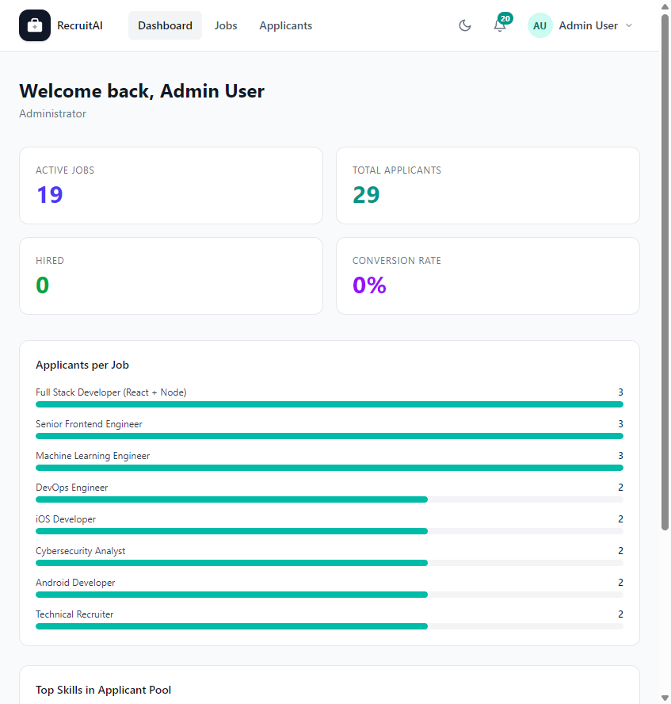

# Dashboard

## Overview

The Dashboard is the first page you see after signing in. It gives you a quick summary of what is happening in Recruitment AI, tailored to your role. The Dashboard is shown below.

## Purpose

The Dashboard exists so you do not have to visit several pages just to see how things are going. Recruiters and Administrators get an overview of hiring activity across the company, while Applicants get a summary of their own job search.

## Available Features

For Recruiters and Administrators, the Dashboard shows:

- A welcome message with your name and role
- Key numbers: Active Jobs, Total Applicants, Hired, and Conversion Rate
- A list of Applicants per Job, showing how many people have applied to each posting
- A summary of the Top Skills found across your Applicant pool
- Quick-action shortcuts to Post a Job and View All Applicants

For Applicants, the Dashboard shows:

- A welcome message with your name
- A summary of your Applications, broken down by status (Applied, Under Review, Shortlisted, Interview Scheduled, Rejected, Hired)
- Quick-action shortcuts to Browse Jobs, My Applications, My Resumes, and Saved Jobs

## Step-by-Step Guide

1. Sign in to Recruitment AI. You are taken to the Dashboard automatically.
2. Review the summary numbers at the top of the page to understand current activity at a glance.
3. Select any job title in the "Applicants per Job" list to open that job's Applicants page directly.
4. Select a quick-action card, such as "Post a Job" or "Browse Jobs", to jump straight to that task.

## Notes

- The information shown depends on your role. Recruiters and Administrators see company-wide hiring data. Applicants see only their own activity.
- If you have not posted any jobs or submitted any applications yet, some summary numbers will show as zero.

## Tips

- Use the Dashboard as your starting point each time you sign in, so you always know what needs your attention before digging into individual pages.
- Recruiters can jump straight to a busy job's Applicants page from the "Applicants per Job" list instead of searching for it on the Jobs page.
