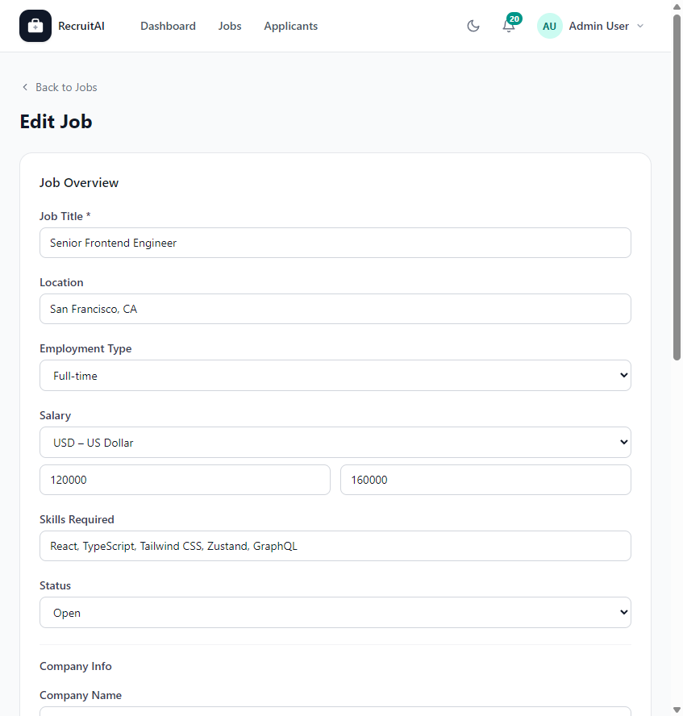

# Edit Job

## Overview

The Edit Job page lets Recruiters, HR staff, and Administrators update the details of a Job Posting that has already been created. The page is shown below.

## Purpose

Job details change over time — a salary range may be adjusted, a location may switch to remote, or a posting may need to be closed. This page lets you keep a Job Posting accurate without recreating it.

## Available Features

- Editable Job Title, Location, Employment Type, and Status (Open or Closed)
- Editable salary range and currency
- Editable list of required skills
- Editable company information, including company name, contact email, and logo
- A rich text editor for the Job Description
- An editable Requirements list
- "Save Changes" to apply your updates, or "Cancel" to discard them

## Step-by-Step Guide

1. Open the Job Posting you want to change and select "Edit Job".
2. Update any fields that need to change, such as the salary range or Status.
3. Use the formatting toolbar to adjust the Job Description if needed.
4. Review the Requirements list and update it if the role has changed.
5. Select "Save Changes" to update the Job Posting, or "Cancel" to return without saving.

## Notes

- This page is available to Recruiters, HR staff, and Administrators.
- Setting Status to "Closed" hides the Job Posting from new Applicants but keeps existing Applications visible.

## Tips

- Close a Job Posting as soon as the role is filled, so Applicants do not apply to a position that is no longer available.
- Double-check the salary range and currency before saving, since these are some of the first details Applicants see.
