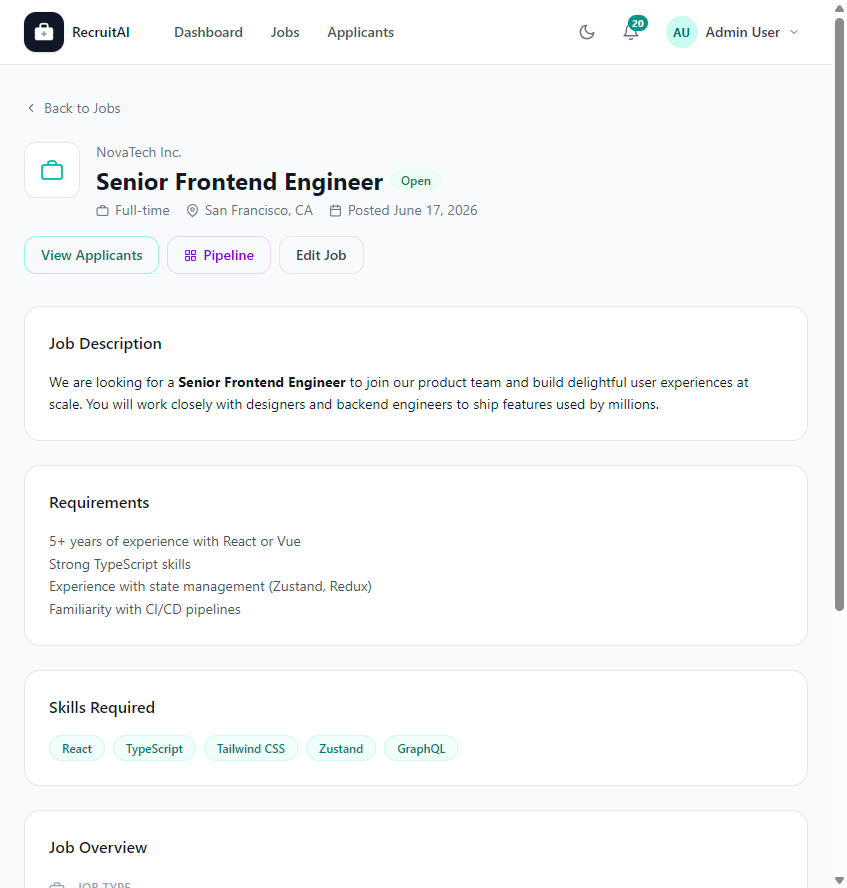

# Job Details

## Overview

The Job Details page shows the full description of a single Job Posting. It can be viewed by guests, Applicants, Recruiters, HR staff, and Administrators. The page is shown below.

## Purpose

This page gives everyone the information they need to decide whether a role is a good fit, and gives Recruiters a quick way to jump into managing that Job Posting.

## Available Features

- Company name, Job Title, Status, Employment Type, Location, and posting date
- Full Job Description and Requirements
- List of required skills
- Job Overview panel with type, location, date posted, salary, and contact email
- "Apply Now" button for Applicants
- "View Applicants", "Pipeline", and "Edit Job" actions for Recruiters, HR staff, and Administrators

## Step-by-Step Guide

1. Select a Job Posting title from the Jobs page to open its details.
2. Review the description, requirements, and skills to understand the role.
3. If you are an Applicant and want to apply, select "Apply Now" and follow the prompts.
4. If you are a Recruiter, HR staff member, or Administrator, use "View Applicants", "Pipeline", or "Edit Job" to manage the posting.

## Notes

- Guests and Applicants viewing this page without signing in can see most job information but not the salary range or "Apply Now" is not available.
- Only Recruiters, HR staff, and Administrators see the management actions ("View Applicants", "Pipeline", "Edit Job").

## Tips

- Read the full Requirements list before applying, so you can tailor your application to the role.
- Recruiters can use this page as a quick checkpoint before sharing a Job Posting link externally.
