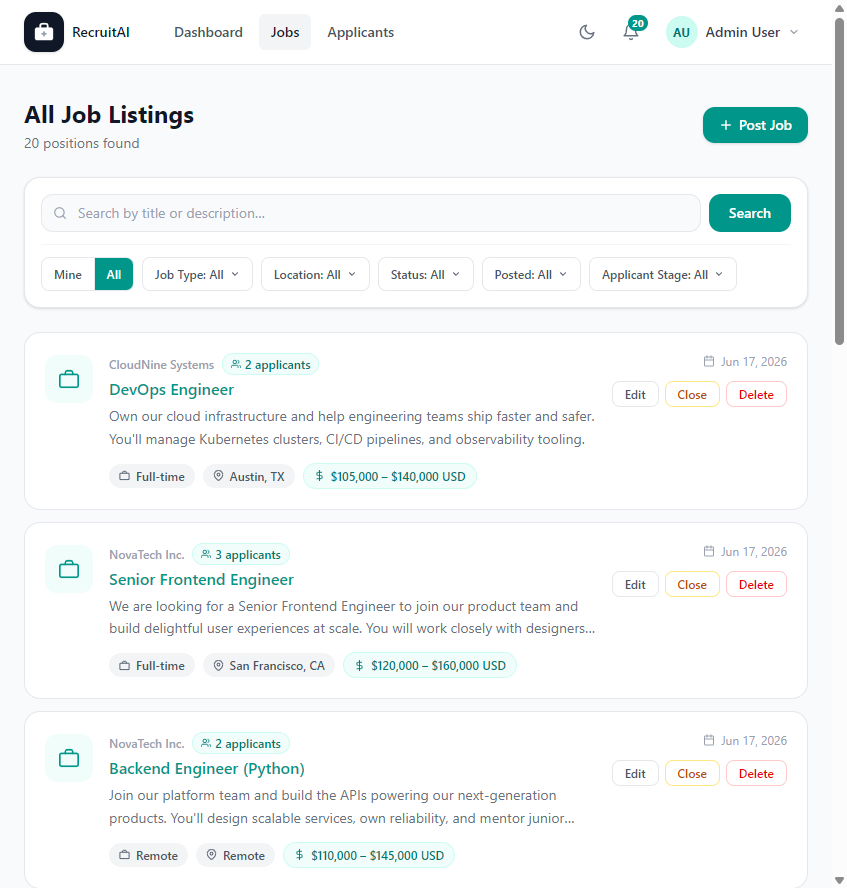

# Jobs

## Overview

The Jobs page lists Job Postings available in Recruitment AI. What you see and can do here depends on whether you are a guest, an Applicant, or a Recruiter, HR staff member, or Administrator. The page is shown below.

## Purpose

This page is where Applicants discover roles to apply for, and where Recruiters, HR staff, and Administrators manage the Job Postings they are responsible for.

## Available Features

For guests and Applicants:

- Browse all open Job Postings
- Search by title or description
- Filter by Job Type, Location, and Posted date

For Recruiters, HR staff, and Administrators:

- Toggle between "Mine" (Job Postings you created) and "All" Job Postings
- Additional filters for Status and Applicant Stage
- "Post Job" button to create a new Job Posting
- "Edit", "Close", and "Delete" actions on each Job Posting
- A count of Applicants per Job Posting, linking directly to that job's Applicants page

## Step-by-Step Guide

1. Open the Jobs page from the main navigation bar.
2. Use the search box to look for a specific role, or use the filters to narrow the list by type, location, or other criteria.
3. Select a Job Title to view its full details.
4. If you manage Job Postings, use "Mine" or "All" to switch between your own postings and every posting in the system.
5. Select "Post Job" to create a new listing, or use "Edit", "Close", or "Delete" on an existing listing to manage it.

## Notes

- Applicants and guests only see Open Job Postings.
- The "Mine" view for Recruiters, HR staff, and Administrators shows only Job Postings they personally created.

## Tips

- Applicants should check back regularly or search by keyword, since new Job Postings are added over time.
- Recruiters should close a Job Posting as soon as it is filled to keep the "All" list accurate for the whole team.
