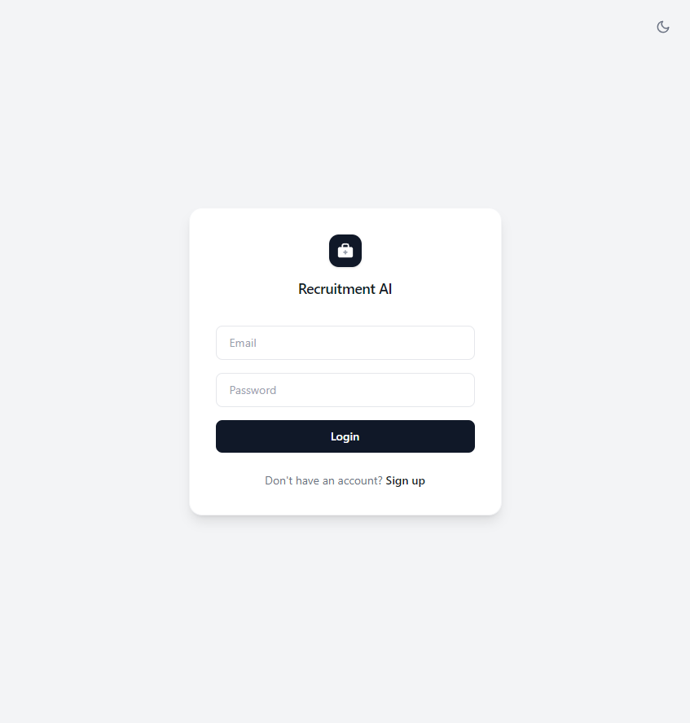

# Login

## Overview

The Login page is where you sign in to Recruitment AI using your email address and password. The page is shown below.

## Purpose

Signing in confirms who you are and shows you the version of Recruitment AI suited to your role, whether you are an Applicant, Recruiter, HR staff member, or Administrator.

## Available Features

- Email and Password fields
- "Login" button
- Link to the Register page for creating a new account

## Step-by-Step Guide

1. Open Recruitment AI. If you are not already signed in, you are shown the Login page.
2. Enter the email address associated with your account.
3. Enter your password.
4. Select "Login".
5. You are taken to your Dashboard once your details are confirmed.

## Notes

- If your email or password is incorrect, you will see an error message and can try again.
- If you do not have an account yet, select "Sign up" to go to the Register page.

## Tips

- Keep your password somewhere safe. You can change it later from your Profile page.
- If you are using a shared computer, remember to log out when you are finished.
