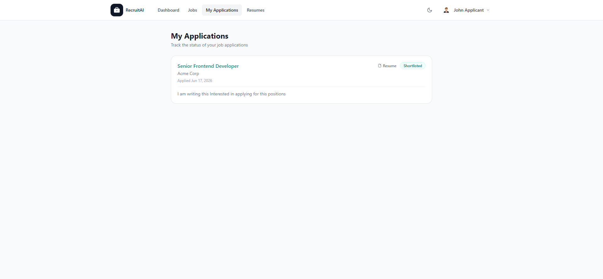

# My Applications

## Overview

My Applications shows every Job Posting you, as an Applicant, have applied to, along with the current status of each one. The page is shown below.

## Purpose

This page lets you keep track of your job search in one place, so you always know where you stand with each Application.

## Available Features

- A list of every Job Posting you have applied to
- The current status of each Application (Applied, Under Review, Shortlisted, Interview Scheduled, Rejected, or Hired)
- A link to browse open positions if you have not applied to any Job Postings yet

## Step-by-Step Guide

1. Select "My Applications" from the navigation bar or from your Dashboard.
2. Review the list of Job Postings you have applied to and their current status.
3. Select a Job Posting to view its details again if you want to review the description or requirements.
4. If you have not applied to anything yet, select "Browse open positions" to find a role.

## Notes

- This page is available to Applicants only.
- Statuses are updated by the Recruiter, HR staff member, or Administrator managing that Job Posting, so a status change may not appear immediately after an interview or decision.

## Tips

- Check back periodically, since Recruiters update statuses as your Applications move through the Pipeline.
- If an Application has stayed on "Applied" for a long time, consider applying to similar roles while you wait.
