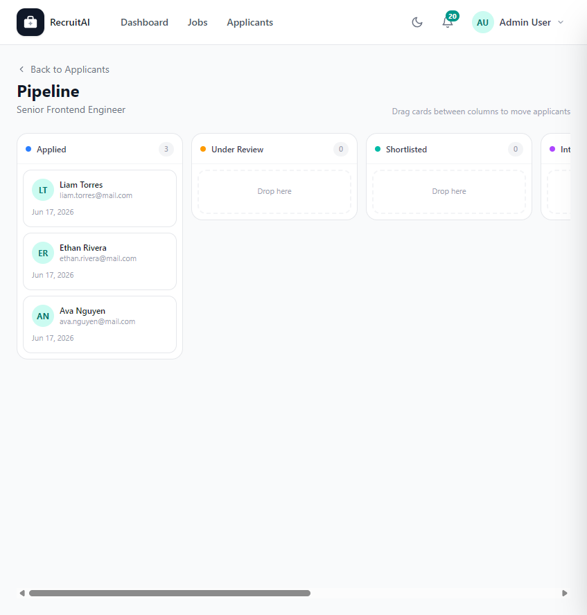

# Pipeline

## Overview

The Pipeline page shows all Applicants for a single Job Posting organized into stages on a board, so you can see progress at a glance. The page is shown below.

## Purpose

Hiring involves moving people through several stages. The Pipeline view makes it easy to see how many Applicants are at each stage and to move them forward without leaving the page.

## Available Features

- Columns for each stage: Applied, Under Review, Shortlisted, Interview Scheduled, Rejected, and Hired
- A count of Applicants in each column
- Drag-and-drop cards to move an Applicant from one stage to another
- A link back to the standard Applicants list for the same Job Posting

## Step-by-Step Guide

1. Open a Job Posting's Applicants page and select "Pipeline".
2. Review how many Applicants are in each stage.
3. Drag an Applicant's card from one column and drop it into another column to update their stage.
4. Select "Back to Applicants" to return to the list view.

## Notes

- This page is available to Recruiters, HR staff, and Administrators.
- Moving a card updates the Applicant's status immediately, and the same change is reflected on the standard Applicants list.

## Tips

- Use the Pipeline view during hiring meetings so everyone can see progress on a role at a glance.
- Keep the "Applied" column moving regularly so new Applicants are not overlooked.
