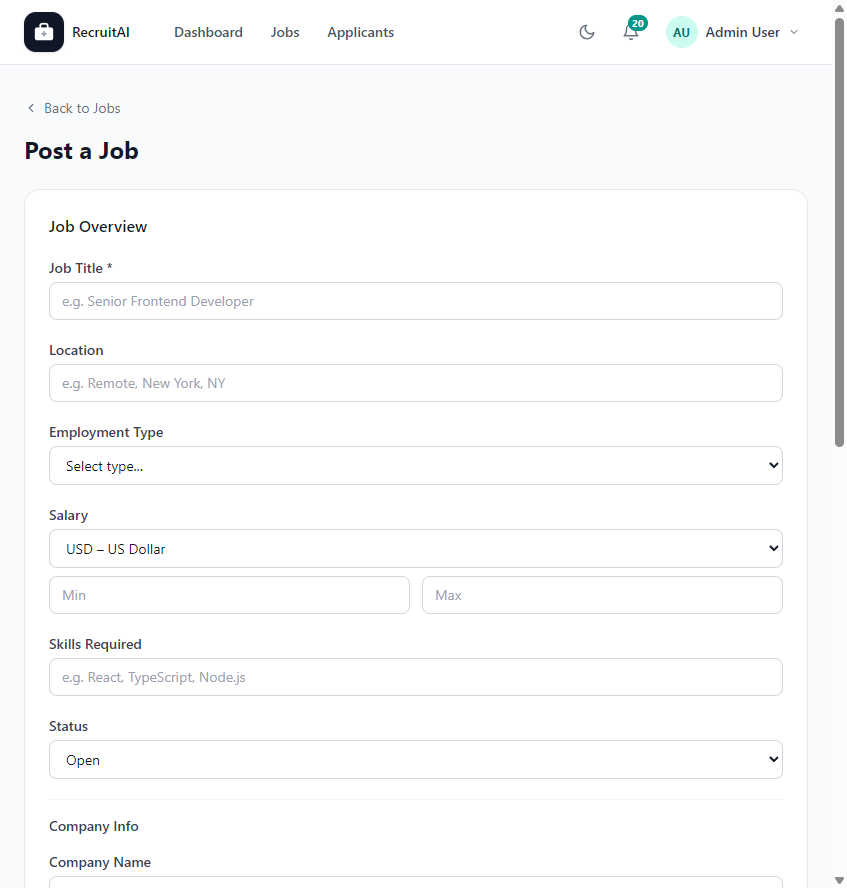

# Post a Job

## Overview

The Post a Job page lets Recruiters, HR staff, and Administrators create a new Job Posting for Applicants to discover and apply to. The page is shown below.

## Purpose

This page is the starting point for hiring. A clear, complete Job Posting attracts the right Applicants and sets expectations before anyone applies.

## Available Features

- Job Title, Location, Employment Type, and Status fields
- Salary range with currency selection
- Skills Required field
- Company Info section, including company name, contact email, and logo upload
- A rich text editor for the Job Description
- A Requirements field for listing key qualifications
- "Post Job" button to publish the listing, or "Cancel" to discard it

## Step-by-Step Guide

1. Select "Post Job" from the Jobs page or from your Dashboard.
2. Enter the Job Title and Location.
3. Choose the Employment Type and set the Status to "Open" so Applicants can see it.
4. Enter the salary range and select the currency.
5. List the required skills, separated by commas.
6. Fill in the Company Info section, including a contact email Applicants can reach.
7. Write the Job Description using the formatting toolbar, and list the Requirements.
8. Select "Post Job" to publish the listing.

## Notes

- This page is available to Recruiters, HR staff, and Administrators.
- A Job Posting with Status set to "Closed" will not appear to Applicants browsing the Jobs page.

## Tips

- Be specific in the Requirements section. Clear requirements help Applicants self-select and save you time reviewing Applications.
- Double-check the contact email before publishing, since this is how Applicants may reach out with questions.
