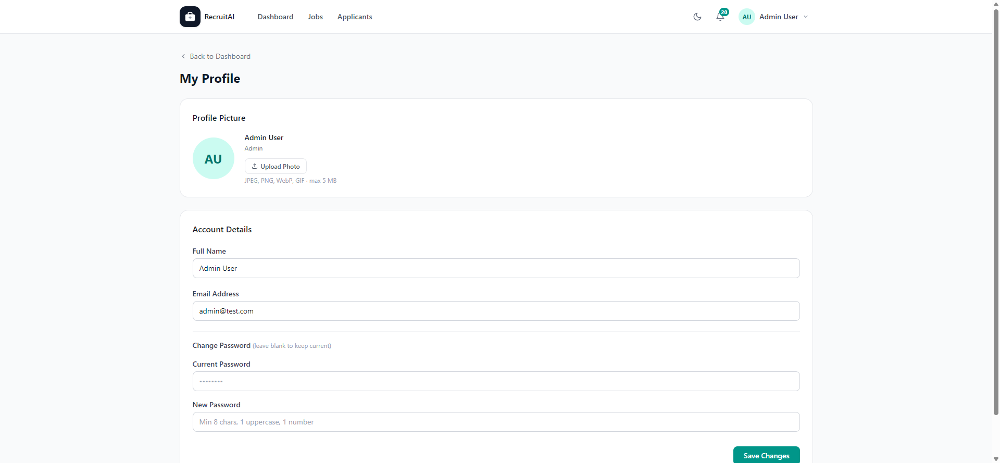

# Profile

## Overview

The Profile page lets you manage your own account details, including your name, email, profile picture, and password. The page is shown below.

## Purpose

Keeping your Profile up to date ensures Recruiters, HR staff, Administrators, or Applicants you interact with see accurate information, and keeps your account secure.

## Available Features

- Profile picture upload
- Editable Full Name and Email Address
- Password change, with a field for your current password and a field for a new password
- "Save Changes" button to apply your updates

## Step-by-Step Guide

1. Select your name or avatar in the top navigation bar, then select "My Profile".
2. Select "Upload Photo" to add or change your profile picture.
3. Update your Full Name or Email Address if needed.
4. To change your password, enter your current password and your new password.
5. Select "Save Changes" to apply your updates.

## Notes

- This page is available to every signed-in user, regardless of role.
- Leave the password fields blank if you do not want to change your password.

## Tips

- Choose a new password with at least 8 characters, including one uppercase letter and one number, as shown in the field guidance.
- Update your profile picture so teammates can recognize you more easily throughout the platform.
