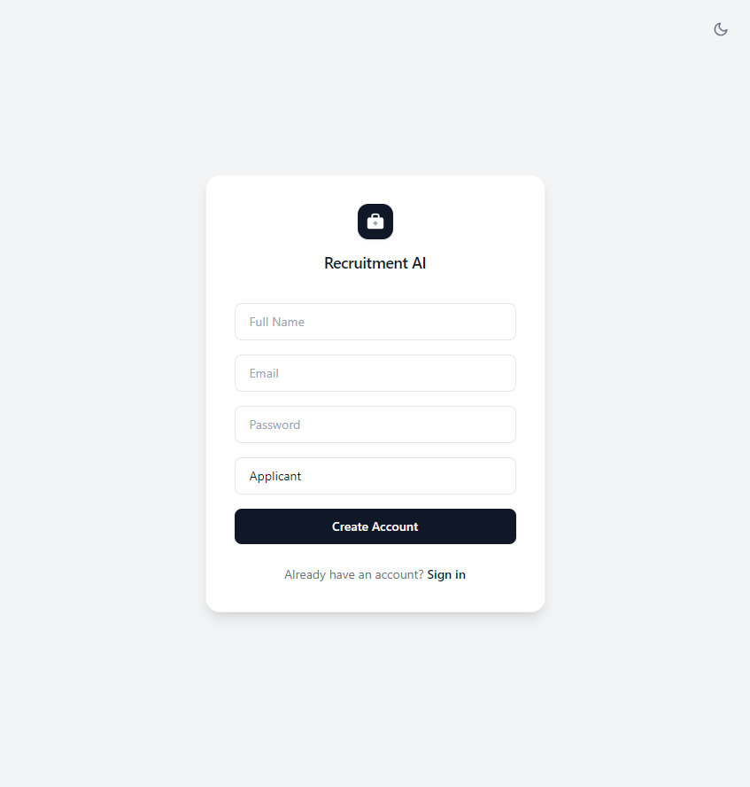

# Register

## Overview

The Register page lets a new user create a Recruitment AI account. The page is shown below.

## Purpose

An account is required to apply for Job Postings, track Applications, or manage hiring, depending on your role. This page is the first step to getting started.

## Available Features

- Full Name, Email, and Password fields
- A role selector, offering Applicant or Recruiter
- "Create Account" button
- Link to the Login page for existing users

## Step-by-Step Guide

1. Open Recruitment AI and select "Sign up" from the Login page.
2. Enter your Full Name, Email, and a Password.
3. Choose whether you are registering as an Applicant or a Recruiter.
4. Select "Create Account".
5. You are signed in and taken to your Dashboard.

## Notes

- Administrator and HR accounts cannot be created from this page. They are assigned manually by an existing Administrator through User Management.
- If you already have an account, select "Sign in" instead of registering again.

## Tips

- Choose the role that matches what you plan to do in Recruitment AI: select Applicant if you want to apply for jobs, or Recruiter if you plan to post and manage Job Postings.
- Use a Password you have not used elsewhere, since it protects access to your Applications or hiring data.
