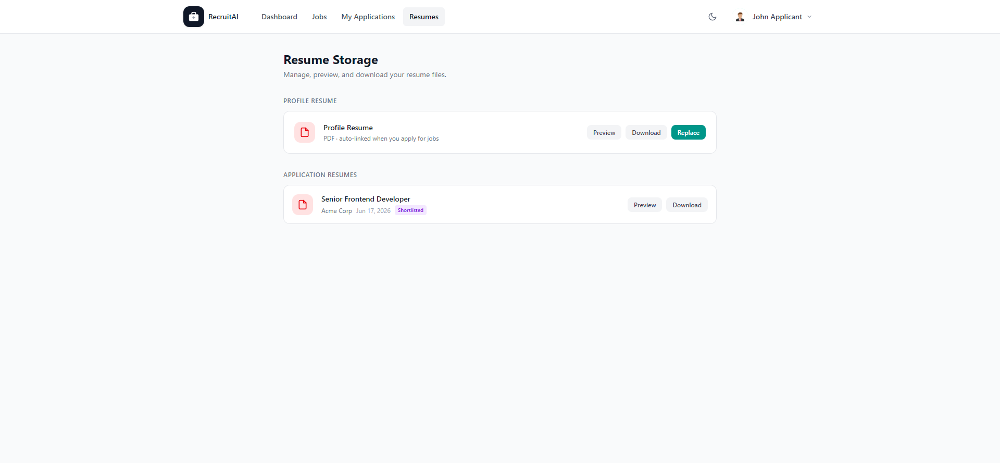

# Resumes

## Overview

Resumes is where you, as an Applicant, manage the Resume files linked to your account and to individual Applications. The page is shown below.

## Purpose

Recruiters review your Resume when deciding how to move your Application forward, so keeping it current and accessible matters. This page gives you one place to preview, download, or replace your files.

## Available Features

- Your Profile Resume, which is automatically linked whenever you apply for a Job Posting
- "Preview", "Download", and "Replace" actions for your Profile Resume
- A list of Application Resumes, showing the Job Title, company, application date, and current status for each one
- "Preview" and "Download" actions for each Application Resume

## Step-by-Step Guide

1. Select "Resumes" from the navigation bar or from your Dashboard.
2. Select "Preview" to view your Profile Resume, or "Download" to save a copy.
3. Select "Replace" to upload a new version of your Profile Resume.
4. Scroll to "Application Resumes" to see the Resume you submitted for each specific Job Posting.

## Notes

- This page is available to Applicants only.
- Replacing your Profile Resume does not change the Resume already submitted for Applications you have already sent.

## Tips

- Keep your Profile Resume up to date, since it is used automatically the next time you apply for a Job Posting.
- If you tailor your Resume for a specific role, check the "Application Resumes" list to confirm the right version was submitted.
