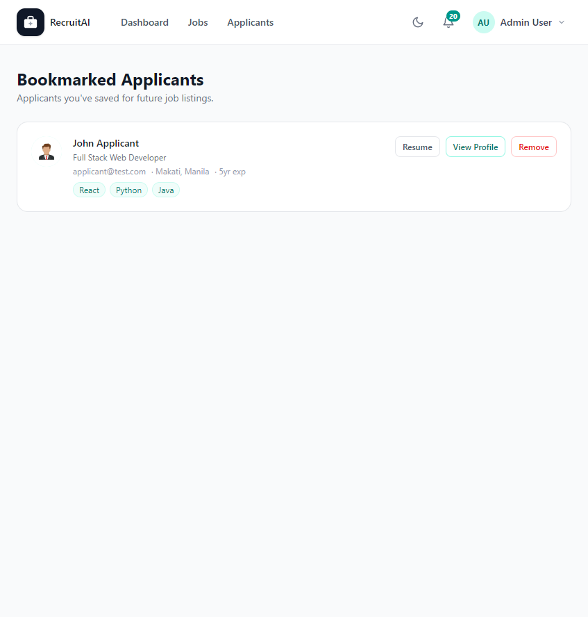

# Saved Applicants

## Overview

Saved Applicants, also called Bookmarked Applicants, lists every Applicant you have bookmarked for future reference. The page is shown below.

## Purpose

Not every strong Applicant fits your current openings. Bookmarking lets Recruiters, HR staff, and Administrators keep track of promising people to reach out to when a matching Job Posting becomes available.

## Available Features

- A list of every Applicant you have bookmarked
- Each Applicant's headline, contact email, location, experience, and skills
- A link to their Resume, when available
- "View Profile" to open their full Applicant Profile
- "Remove" to un-bookmark an Applicant

## Step-by-Step Guide

1. Bookmark an Applicant from the Applicants page or their Applicant Profile by selecting the bookmark icon or "Bookmark" button.
2. Select "Bookmarked Applicants" from your account menu to see everyone you have saved.
3. Select "View Profile" to review an Applicant again, or "Resume" to open their Resume.
4. Select "Remove" if an Applicant is no longer relevant to keep on this list.

## Notes

- This page is available to Recruiters, HR staff, and Administrators.
- If you have not bookmarked anyone yet, this page will tell you and suggest bookmarking Applicants from their profile page.

## Tips

- Review your Saved Applicants whenever you post a new Job Posting, since a previously bookmarked Applicant may be a great fit.
- Remove Applicants who are no longer looking for work to keep this list useful.
