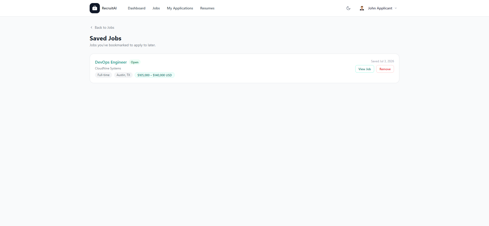

# Saved Jobs

## Overview

Saved Jobs lists every Job Posting you, as an Applicant, have bookmarked to apply to later. The page is shown below.

## Purpose

Sometimes you find an interesting role but are not ready to apply right away. Saving it means you will not have to search for it again later.

## Available Features

- A list of every Job Posting you have bookmarked
- Each job's title, company, Status, Employment Type, Location, and salary range
- The date you saved the job
- "View Job" to open the full Job Details page
- "Remove" to un-bookmark a job

## Step-by-Step Guide

1. While browsing the Jobs page, select "Save job" on a listing you are interested in.
2. Select "Saved Jobs" from your account menu to see everything you have bookmarked.
3. Select "View Job" to read the full details and apply when you are ready.
4. Select "Remove" if you are no longer interested in a saved job.

## Notes

- This page is available to Applicants only.
- If you have not saved any jobs yet, this page will tell you and suggest browsing the Jobs page.

## Tips

- Save a job as soon as you find it interesting, even if you plan to finish your Application later.
- Check your Saved Jobs before a Job Posting closes, since a saved job can still be filled by other Applicants.
