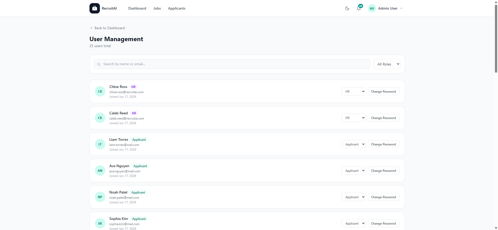

# User Management (Administrators Only)

## Overview

User Management gives Administrators a complete list of every account in Recruitment AI, along with the ability to change roles and reset passwords. The page is shown below.

## Purpose

As the platform grows, Administrators need a way to see who has access, correct a role that was set up incorrectly, and help users who are locked out of their accounts.

## Available Features

- A total count of users in the system
- Search by name or email
- Filter by role (Applicant, Recruiter, HR, Admin)
- Each user's name, email, role, and join date
- A dropdown to change a user's role
- "Change Password" to reset a user's password

## Step-by-Step Guide

1. Select "User Management" from your account menu.
2. Use the search box or role filter to find a specific user.
3. Use the role dropdown next to a user to change their role, for example from Applicant to Recruiter.
4. Select "Change Password" if a user needs their password reset.

## Notes

- This page is available to Administrators only.
- You cannot change your own role from this page. Your own account is shown for reference but without a role dropdown.

## Tips

- Double-check a user's identity before changing their role, since roles control what pages and actions they can access.
- Use the role filter to periodically review how many Recruiters, HR staff, or Administrators currently have access.
